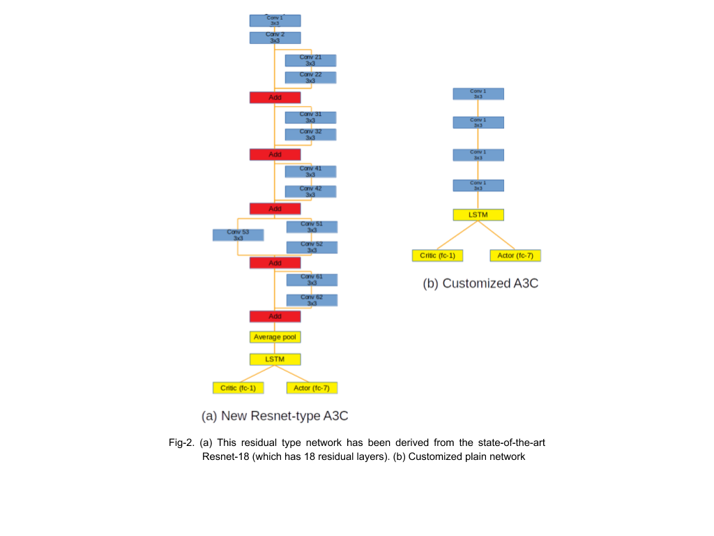

# Resnet-type Architecture for Actor-Critic Reinforcement learning
### Objective 
To use a deeper neural network for feature extraction in an actor-critic algorithm for reinforcement learning.

### Background
Actor-Critic models are a popular form of Policy Gradient model. Customized actor-critic methods use a smaller version of the convolution neural network. Actor-critic uses two neural network- (a) Critic- that measures how good the action taken is (value-based) and (b) an Actor that controls how our agent behaves (policy-based).
<p align="center">
 
</p>

<p align="center">
<em> Fig-1.(a) A3C is highly compatible with parallel processing. There is a global network which shares its parameter with the worker network. These worker networks update the global network asynchronously.</em>
</p>

<p align="center">

</p>

<p align="center">
<em> Fig-1.(b) Diagram of a customized Actor-critic architecture</em>
</p>

Customized A3C architecture passes the input state st through a sequence of four convolution layers with 32 filters each, a kernel size of 3x3, a stride of 2 and padding of 1. An exponential
linear unit (ELU) is used after each convolution layer. The output of the last convolution layer is fed into an LSTM with 256 units. Two separate fully connected layers are used to predict the value function and the action from the LSTM feature representation.

In this study, we hypothesize that using deeper convolution networks would extract higher-level features resulting in better performance and an increase in the average reward per episode.

### Experiment

Here, we use the following architecture for feature extraction. The reward the agent receives is its distance from the flag and the time left to end the game. The aim is to reach the end flag faster.

### Architecture
First, the input state (st) is passed through 2 convolution layers with 32 filters each, a kernel size of 3x3, a stride of 2 and padding of 1. The output is passed through the following residual layers.

 

'''<p align="center">
<em> Fig-2. (a) This residual type network has been derived from the state-of-the-art Resnet-18 (which has 18 residual layers). (b) Customized plain network</em>
</p>'''

Residual networks utilize skip connections to jump over some layers. One motivation for skipping over layers in ANNs is to avoid the problem of vanishing gradients by reusing activations from a previous layer until the layer next to the current one has learned its weights. During training, the weights will adapt to mute the previous layer and amplify the layer next to the current. The intuition on why this works is that the neural network collapses into fewer layers in the initial phase, which makes it easier to learn, and thus gradually expands the layers as it learns more of the feature space.

### Results
<p align="center">

</p>

<p align="center">
<em> Fig-3 (a) Plot of total rewards achieved vs the number of training steps required. The orange line represents the performance of Baseline A3C (using customized architecture). The blue line represents the Resnet-type architecture performance averaged over 3 runs. </em>
</p>

<p align="center">

</p>

<p align="center">
<em> Fig-3 (b) The plot of the number of training steps required to reach the end flag. The orange represents Resnet-type architecture performance and blue represents Baseline customized architecture </em>
</p>

Fig-3(a) implies that there is an initial exploration rise for Reset-type architecture, however, in long-term, it is unable to fetch more rewards compared to traditional actor-critic. Fig-3(b) shows the number of steps it takes for each algorithm to reach the end-flags. Astonishingly the resnet-type architecture reaches the end flag much earlier relative to the older algorithm, however, it is unable to reach the flag in the subsequent episodes. Whereas, in the case of the customised network, the agent is able to reach the end flag in about 4.3M frames but it reaches the flag subsequently thereafter. 

### Discussion
One of the reasons to speculate for the above-mentioned results for the network to not be able to generalise to subsequent episodes ones it has reached the flag in case of resnet type architecture is the increase in the number of parameters to optimise.

## Prerequisites
- Python3.5+
- PyTorch 0.4.0
- OpenAI Gym ==0.10.8
```
pip3 install -r requirements.txt
```

## Training

First, create a folder (name it "save") in your workspace (os.path). In the save folder, create a .csv file for storing all the log (name it mario_curves.csv). Now you are good to go.

Clone the repository
```
git clone https://github.com/Ameyapores/Exploration
cd Exploration
```
Start training
```
python3 main.py 

